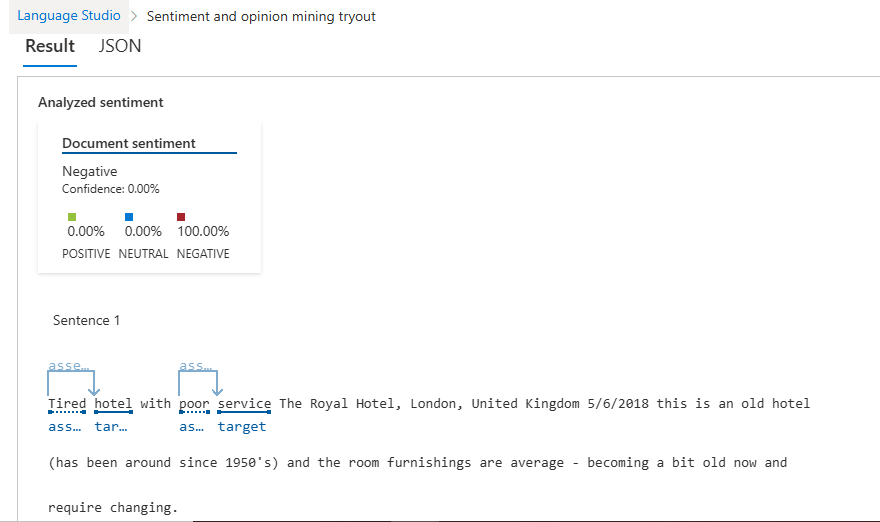

# Language Studio

## 5 dicas para usar o Language Studio!

### 1 - Explore os modelos pré-treinados
O Language Studio já vem com modelos de IA treinados para tarefas como análise de sentimentos, extração de frases-chave, detecção de linguagem e categorização de texto. Experimente com os seus próprios dados antes de criar um modelo personalizado.

### 2 - Use o Custom Text Classification e NER para projetos específicos
Quando os modelos prontos não atendem às suas necessidades, pode treinar classificadores personalizados ou modelos de reconhecimento de entidades nomeadas (NER). Ideal para aplicações em áreas específicas como medicina, jurídico ou financeiro

### 3 - Teste diretamente no browser sem escrever código
Pode usar o Language Studio para carregar documentos, configurar tarefas de processamento e visualizar resultados de forma gráfica — tudo isso sem escrever uma linha de código.

### 4 - Integração com o Azure Cognitive Services
Após configurar e treinar modelos no Language Studio, pode facilmente integrá-los às suas aplicações usando as APIs do Azure Cognitive Services. Isso facilita muito a implantação em soluções reais.

### 5 - Aproveite os exemplos e tutoriais prontos
A Microsoft oferece diversos exemplos, guias passo-a-passo e conjuntos de dados de demonstração diretamente no Language Studio. Use-os para aprender rapidamente ou como base para os seus próprios projetos.

# Na imagem abaixo temos um exemplo do Language Studio Azure!

